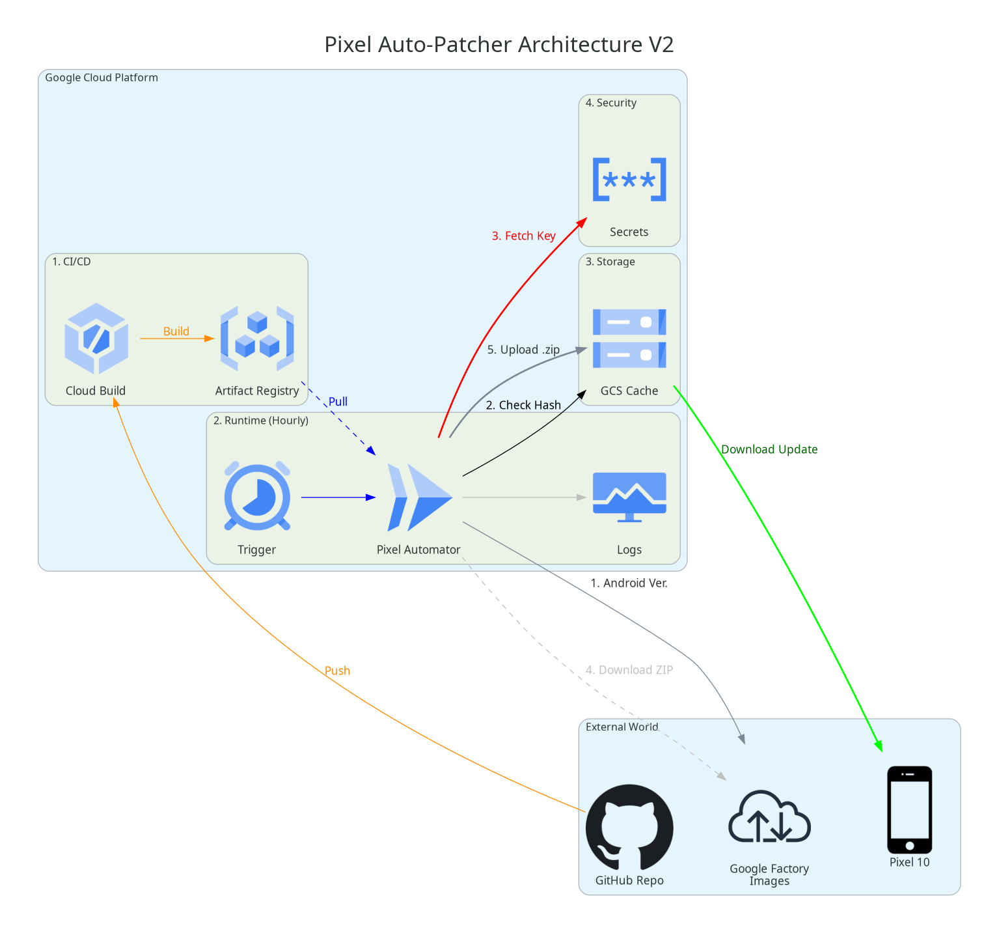

# Pixel Firmware Automator

This project automates the process of patching stock Google Pixel OTA images to include Magisk/KernelSU and signing them with a custom AVB key. The workflow is fully containerized and designed for Google Cloud Build, but supports local Docker execution.

It creates a verifiable, signed OTA update zip that can be flashed via `adb sideload` or `fastboot update`.

## 🛡️ Security Audit Summary (2025-12-07)

**Risk Level:** ⚠️ **LOW (with backup)**
**Status:** ✅ **Safe for Daily Driver**

*   **Data Safety:** The patcher **NEVER** touches user data partitions (`/data`). It only modifies the `boot`/`init_boot` partition within the update package.
*   **Verification:**
    *   **Input:** Google Stock Images are SHA256 verified against Google's official headers.
    *   **Output:** The final image is signed with your private AVB key.
*   **Reversibility:** Flashing a stock OTA wipes the modifications, restoring the device to a lockable clean state (if needed).

**Requirements for Safety:**
1.  **Bootloader Unlock:** Must stay unlocked (or be re-locked with custom keys - advanced).
2.  **Backups:** Always recommended before flashing system updates.

## 🚀 Quick Start (Local Docker)

The easiest way to run the patcher is via Docker. It handles all dependencies (avbroot, python, payload dumping).

### 1. Build the Image
```bash
docker build -t pixel_builder .
```

### 2. Run Patcher
Mount your output directory and private key:
```bash
docker run --rm -it \
    -v "$(pwd)/output:/app/output" \
    -v "$(pwd)/cyber_rsa4096_private.pem:/app/cyber_rsa4096_private.pem" \
    pixel_builder --skip-hash-check
```

**What happens next:**
1.  **Auto-Download:** Scrapes Google's OTA site for the latest image for your device (default: `frankel`).
2.  **Smart Filtering:** Prioritizes EMEA/Global builds over carrier-specific ones (Verizon/Japan).
3.  **Patching:** Uses `avbroot` to inject Magisk directly into `payload.bin` and resign the payload with your key.
4.  **Result:** A closed, signed `ksu_patched_*.zip` ready for flashing.

## ☁️ Cloud Architecture

*   **Cloud Build:** Orchestrates the pipeline.
*   **Cloud Run:** executes the container.
*   **Secret Manager:** Stores the private AVB key.
*   **GCS (Storage):** Caches stock images and stores the final patched artifacts.



## 📂 File Structure

*   `src/pixel_automator.py`: Main Orchestrator.
*   `src/downloader.py`: Intelligent scraper for Google OTA images.
*   `src/avb_patcher.py`: Wrapper for `avbroot` operations.
*   `src/verifier.py`: Integrity checks.
*   `Dockerfile`: Build environment.