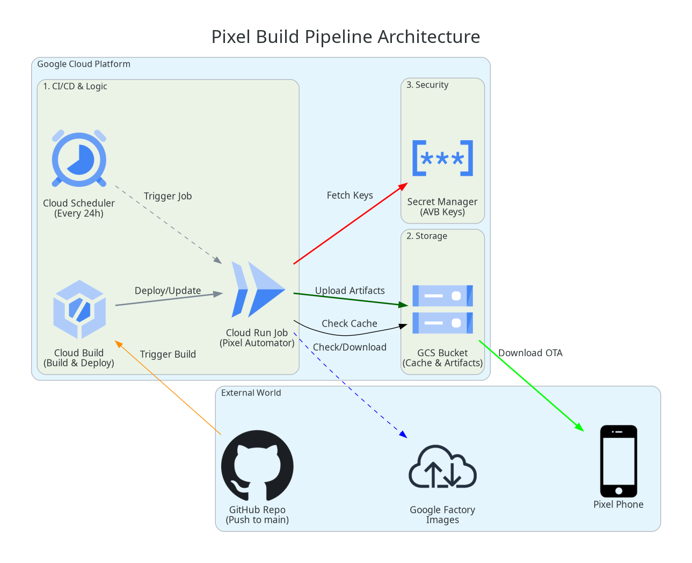

# Pixel Firmware Automator

This project automates the process of patching stock Google Pixel OTA images to include Magisk/KernelSU and signing them with a custom AVB key. The workflow is fully containerized and designed for Google Cloud Build, but supports local Docker execution.

It creates a verifiable, signed OTA update zip that can be flashed via `adb sideload` or `fastboot update`.

## 🛡️ Security Audit Summary (2025-12-07)

**Risk Level:** ⚠️ **LOW (with backup)**
**Status:** ✅ **Safe for Daily Driver**

*   **Data Safety:** The patcher **NEVER** touches user data partitions (`/data`). It only modifies the `boot`/`init_boot` partition within the update package.
*   **Verification:**
    *   **Input:** Google Stock Images are SHA256 verified against Google's official headers.
    *   **Output:** The final image is signed with your private AVB key.
*   **Reversibility:** Flashing a stock OTA wipes the modifications, restoring the device to a lockable clean state (if needed).

**Requirements for Safety:**
1.  **Bootloader Unlock:** Must stay unlocked (or be re-locked with custom keys - advanced).
2.  **Backups:** Always recommended before flashing system updates.

## 💻 Local Developmnent (Offline Mode)

You can run the entire pipeline locally without touching Google Cloud.

### Prerequisities (Linux)
1.  **WebUSB Permissions**: Allow Chrome to access your phone.
    ```bash
    echo 'SUBSYSTEM=="usb", ATTR{idVendor}=="18d1", MODE="0666", GROUP="plugdev"' | sudo tee /etc/udev/rules.d/51-android.rules
    sudo udevadm control --reload-rules && sudo udevadm trigger
    # REPLUG DEVICE
    ```
2.  **Private Key**: Ensure `cyber_rsa4096_private.pem` is in the project root.

### One-Click Run
We provide a helper script to fix permissions, generate keys, and run the builder:
```bash
./run_local_full.sh
```

### Manual Commands
If you prefer running Docker manually:

**1. Build Image**
```bash
docker build -t pixel-automator:latest .
```

**2. Generate AVB Key (Required for flashing)**
```bash
docker run --rm --entrypoint /usr/bin/python3 \
  -v $(pwd):/work -w /work \
  pixel-automator:latest \
  /usr/local/bin/avbtool.py extract_public_key --key cyber_rsa4096_private.pem --output output/keys/avb_pkmd.bin
```

**3. Run Builder**
```bash
docker run --rm -it \
  -e _DEVICE_CODENAME=frankel \
  -v $(pwd)/output:/app/output \
  -v $(pwd)/cyber_rsa4096_private.pem:/app/cyber_rsa4096_private.pem \
  pixel-automator:latest
```

### 🌐 Web Interface (Local)
The web interface detects `localhost` and automatically serves builds from your local `output` folder.

```bash
cd web
npm run dev
# Open http://localhost:5173
```
Flashing will happen directly from your hard drive (Offline).

## ☁️ Cloud Architecture

*   **Cloud Build:** Orchestrates the pipeline.
*   **Cloud Run:** executes the container.
*   **Secret Manager:** Stores the private AVB key.
*   **GCS (Storage):** Caches stock images and stores the final patched artifacts.



## 📂 File Structure

*   `src/pixel_automator.py`: Main Orchestrator.
*   `src/downloader.py`: Intelligent scraper for Google OTA images.
*   `src/avb_patcher.py`: Wrapper for `avbroot` operations.
*   `src/verifier.py`: Integrity checks.
*   `Dockerfile`: Build environment.